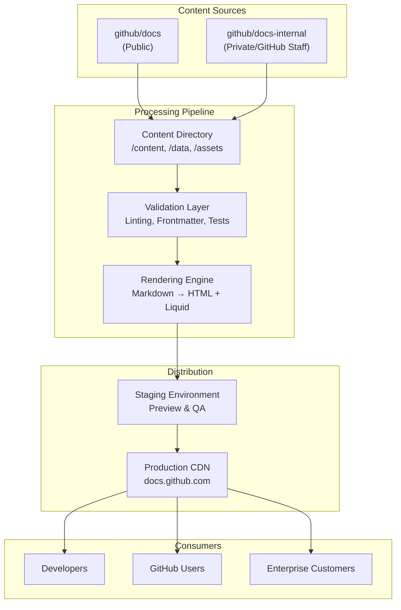
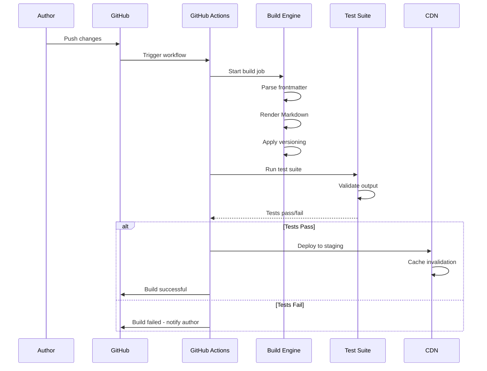

# GitHub Docs Architecture

This document provides a comprehensive overview of the GitHub Docs system architecture, including the content workflow, repository structure, build process, and deployment pipeline.

## Table of Contents

- [System Architecture](#system-architecture)
- [Content Workflow](#content-workflow)
- [Repository Structure](#repository-structure)
- [Build and Deployment](#build-and-deployment)
- [Versioning Strategy](#versioning-strategy)

## System Architecture



## Content Workflow

### Contribution Flow

1. **Author Contribution**
   - GitHub employees contribute via `docs-internal` (private)
   - Open source contributors submit via `github/docs` (public)
   - Both repositories sync frequently to keep content in sync

2. **Content Storage**
   - Markdown files stored in `/content` directory (organized by product)
   - Reusable content in `/data` directory
   - Images and assets in `/assets` directory

3. **Validation**
   - Automated linting checks (Markdown, YAML frontmatter)
   - Spellcheck and style validation
   - Frontmatter schema validation
   - Link validation

4. **Review & Approval**
   - Pull request review by maintainers
   - Automated status checks must pass
   - Staging preview for visual review

5. **Publishing**
   - Merge to default branch triggers build
   - Site regenerated with new content
   - Changes propagated to CDN within minutes

## Repository Structure

```
github/docs/
├── .github/
│   ├── workflows/              # GitHub Actions workflows
│   ├── CONTRIBUTING.md         # Contribution guidelines
│   └── pull_request_template.md
├── content/
│   ├── admin/                  # GitHub Enterprise admin docs
│   ├── github/                 # GitHub.com features
│   ├── actions/                # GitHub Actions documentation
│   ├── codespaces/             # Codespaces docs
│   └── [product]/              # Product-specific content
├── data/
│   ├── reusables/              # Reusable content blocks
│   ├── variables/              # Global variables
│   └── glossaries/             # Glossary definitions
├── assets/
│   ├── images/                 # Screenshots and diagrams
│   ├── css/                    # Stylesheets
│   └── js/                     # JavaScript files
├── src/
│   ├── frame/                  # Core framework code
│   ├── versions/               # Version handling logic
│   ├── rendering/              # Content rendering
│   ├── redirects/              # Redirect handling
│   └── tests/                  # Test suite
└── README.md                   # Repository overview
```

## Build and Deployment

### Build Process



### Key Technologies

- **Markdown Parser**: Processes `.md` files with Liquid templating
- **Versioning Engine**: Handles conditional content based on product version
- **Rendering Layer**: Converts markdown to HTML with proper formatting
- **Testing Framework**: Validates generated output
- **CDN**: Cloudflare or similar for global distribution

## Versioning Strategy

The docs support multiple versions of GitHub products:

- **fpt** (Free, Pro, Team) - GitHub.com
- **ghes** (GitHub Enterprise Server) - Self-hosted versions
- **ghec** (GitHub Enterprise Cloud) - Enterprise cloud offering
- **ghae** (GitHub AE) - Azure deployment

### Frontmatter Versioning

```yaml
---
title: Feature Name
versions:
  fpt: '*'
  ghes: '>=3.0'
  ghec: '*'
  ghae: '*'
---
```

### Liquid Conditional Rendering

```liquid

This content only appears on GitHub.com



This content only appears on GitHub Enterprise Server

```

## Key Features

### Search and Navigation
- Full-text search powered by Elasticsearch
- Sidebar navigation with versioning awareness
- Breadcrumb trails for easy navigation

### Localization
- Content available in multiple languages
- Separate build processes per language
- Community translation contributions

### Performance
- Static site generation (fast page loads)
- Global CDN distribution
- Aggressive caching strategies
- Link prefetching for navigation

### Developer Experience
- Local development environment setup
- Hot reload during development
- Automated testing in pull requests
- Clear error messages and debugging

## Best Practices

1. **Content Organization**
   - Follow kebab-case naming conventions
   - Group related content in product directories
   - Use descriptive, SEO-friendly titles

2. **Frontmatter**
   - Always include `versions` frontmatter (required)
   - Use `shortTitle` for navigation display
   - Include `intro` for article preview text

3. **Links and References**
   - Use relative links to other docs
   - Use `[AUTOTITLE]` for automatic link text
   - Include version-specific links when needed

4. **Images and Assets**
   - Optimize images before committing
   - Use meaningful file names
   - Include alt text for accessibility

5. **Testing**
   - Run local tests before pushing
   - Review staging preview
   - Test across multiple product versions

## Deployment Environments

### Staging
- Auto-deployed on every merge to main
- Full preview of changes
- URL: `staging-docs.github.com` (internal)
- Retention: Latest version only

### Production
- Manual promotion from staging
- Runs on global CDN
- URL: `docs.github.com`
- 99.9% uptime SLA

## Monitoring and Maintenance

- Automated health checks
- Performance monitoring
- Error tracking and alerting
- Regular dependency updates
- Security vulnerability scanning

---

For more details, see:
- [Contributing Guide](../contributing/README.md)
- [Development Setup](../contributing/development.md)
- [GitHub Docs GitHub Repository](https://github.com/github/docs)
